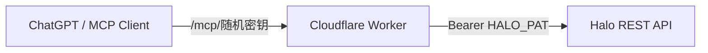

# Halo MCP Gateway

一个部署在 **Cloudflare Workers** 上的 Halo MCP 服务，把 Halo 的 **标签、分类、文章**整理成严格的 12 个 CRUD 工具，供 ChatGPT 等 MCP 客户端直接调用。

```text
3 类资源 × 4 个动作 = 12 个 MCP Tools
```

项目通过 Halo Personal Access Token（PAT）调用 Halo API，并使用高强度随机路径密钥保护远程 MCP Endpoint。PAT 和随机密钥都只保存在 Cloudflare Worker Secrets 中。

## 功能

### 标签 Tag

| Tool | 作用 |
|---|---|
| `halo_create_tag` | 创建标签 |
| `halo_query_tags` | 查询单个标签或分页查询标签列表 |
| `halo_update_tag` | 修改标签 |
| `halo_delete_tag` | 删除标签 |

### 分类 Category

| Tool | 作用 |
|---|---|
| `halo_create_category` | 创建分类 |
| `halo_query_categories` | 查询单个分类或分页查询分类列表 |
| `halo_update_category` | 修改分类 |
| `halo_delete_category` | 删除分类 |

### 文章 Article

| Tool | 作用 |
|---|---|
| `halo_create_article` | 创建 Markdown 文章，可直接发布或保存草稿 |
| `halo_query_articles` | 查询单篇文章或分页/关键词查询文章 |
| `halo_update_article` | 修改标题、Markdown、分类、标签、发布状态等 |
| `halo_delete_article` | 默认移入回收站，可显式确认永久删除 |

所有工具均提供 MCP `inputSchema`、`outputSchema` 和 `structuredContent`。

## 工作方式



安全模型：

- `HALO_PAT` 不发送给 ChatGPT
- `MCP_GATEWAY_KEY` 不写入源码或 `wrangler.toml`
- 错误随机密钥直接返回 `404 Not Found`
- 文章删除默认进入回收站，降低 AI 误删除风险

## 资源行为

### 标签 / 分类默认名称

创建标签或分类时，如果没有手动提供 `slug`，Worker 会将显示名称转换成**无声调小写拼音，并使用 `-` 分隔**。

例如：

```text
人工智能
→ slug: ren-gong-zhi-neng
→ metadata.generateName: ren-gong-zhi-neng-

技术分享
→ slug: ji-shu-fen-xiang
→ metadata.generateName: ji-shu-fen-xiang-
```

如果显式传入 `slug`，则优先使用传入值。

### 查询工具

三个 Query 工具都支持两种模式：

- 传 `name`：按 Halo `metadata.name` 查询单个资源
- 不传 `name`：查询列表

这样无需额外拆分 `get/list/search`，始终保持 12 个 MCP 工具。

### 文章创建与更新

文章正文使用 Markdown。创建文章时：

```json
{
  "publish": true
}
```

表示创建后立即发布；`publish=false` 则保存为草稿。

文章更新采用部分更新，只修改调用参数中显式提供的字段，可更新：

- 标题
- Markdown 正文
- slug
- 摘要
- 封面
- 标签
- 分类
- 评论开关
- 置顶/优先级
- 可见性
- 发布状态

文章中的标签和分类必须已经存在；建议让 AI 先查询，不存在时再调用对应 Create 工具。

### 删除安全

标签和分类删除是永久操作。

文章删除默认只进入 Halo 回收站：

```json
{
  "name": "post-xxx"
}
```

永久删除必须明确传入双重确认：

```json
{
  "name": "post-xxx",
  "permanent": true,
  "confirm_permanent": true
}
```

## 前置条件

你需要：

- Halo 2.x 站点
- 一个拥有对应文章/标签/分类权限的 Halo PAT
- Cloudflare 账号
- Node.js 20+
- 支持远程 MCP / Streamable HTTP 的客户端，例如 ChatGPT Developer Mode

## 操作流程

### 1. 克隆仓库

```powershell
git clone https://github.com/wangling-miao/halo-mcp.git
cd halo-mcp
```

### 2. 安装依赖

```powershell
npm install
npm run typecheck
```

项目使用：

- `marked`：Markdown → HTML
- `pinyin-pro`：标签/分类默认拼音 slug

国内 npm 网络不稳定时可以临时切换镜像：

```powershell
npm config set registry https://registry.npmmirror.com
npm install
```

### 3. 配置 Halo 地址

编辑 `wrangler.toml`：

```toml
[vars]
HALO_BASE_URL = "https://your-halo.example.com"
HALO_TIMEOUT_MS = "30000"
MCP_ALLOWED_ORIGINS = "https://chatgpt.com,https://chat.openai.com"
```

不要把 PAT 写进 `wrangler.toml`。

### 4. 创建 Halo PAT

在 Halo 后台创建 Personal Access Token，并确保它拥有文章、分类、标签所需的读写权限。

PAT 只需要放进 Cloudflare Secret。

### 5. 生成随机 MCP 密钥

```powershell
python -c "import secrets; print(secrets.token_urlsafe(32))"
```

### 6. 配置 Secrets

复制示例文件：

```powershell
Copy-Item .env.production.example .env.production
```

编辑：

```dotenv
HALO_PAT=pat_xxxxxxxxxxxxxxxxxxxxxxxxxxxxxxxx
MCP_GATEWAY_KEY=你的高强度随机密钥
```

也可以逐项写入 Cloudflare：

```powershell
npx wrangler@latest secret put HALO_PAT
npx wrangler@latest secret put MCP_GATEWAY_KEY
```

> `.env.production` 不要提交到 Git。

### 7. 部署到 Cloudflare Workers

```powershell
npx wrangler@latest login
npx wrangler@latest deploy --secrets-file .env.production
```

部署后会得到类似：

```text
https://halo-mcp-gateway.<account>.workers.dev
```

真正的 MCP Endpoint 是：

```text
https://halo-mcp-gateway.<account>.workers.dev/mcp/<MCP_GATEWAY_KEY>
```

### 8. 接入 ChatGPT

在 ChatGPT 中：

1. 打开 Developer Mode / 自定义 MCP
2. 添加远程 MCP
3. Transport 选择 Streamable HTTP / Streaming HTTP
4. Authentication 选择 `No Authentication`
5. Endpoint 填写 `/mcp/<MCP_GATEWAY_KEY>` 完整地址
6. Scan / Refresh Tools

`No Authentication` 不代表接口公开：随机路径本身就是网关认证密钥，Halo PAT 仍由 Worker 私下保存和注入。

### 9. 测试

```powershell
.\scripts\test.ps1 `
  -BaseUrl "https://halo-mcp-gateway.<account>.workers.dev" `
  -GatewayKey "你的MCP_GATEWAY_KEY"
```

脚本会检查：

- `/health`
- MCP `initialize`
- `notifications/initialized`
- `tools/list`
- 工具数量是否严格为 `12`

要实际调用 Halo 只读 API：

```powershell
.\scripts\test.ps1 `
  -BaseUrl "https://halo-mcp-gateway.<account>.workers.dev" `
  -GatewayKey "你的MCP_GATEWAY_KEY" `
  -CallHaloRead
```

## Halo API 路径

标签与分类使用 Halo Extension API：

```text
GET/POST       /apis/content.halo.run/v1alpha1/tags
GET/PUT/DELETE /apis/content.halo.run/v1alpha1/tags/{name}

GET/POST       /apis/content.halo.run/v1alpha1/categories
GET/PUT/DELETE /apis/content.halo.run/v1alpha1/categories/{name}
```

文章主要使用 User Center API，以保留 Halo 的草稿、发布和回收站流程：

```text
POST /apis/uc.api.content.halo.run/v1alpha1/posts
GET  /apis/uc.api.content.halo.run/v1alpha1/posts
GET  /apis/uc.api.content.halo.run/v1alpha1/posts/{name}
PUT  /apis/uc.api.content.halo.run/v1alpha1/posts/{name}
GET  /apis/uc.api.content.halo.run/v1alpha1/posts/{name}/draft?patched=true
PUT  /apis/uc.api.content.halo.run/v1alpha1/posts/{name}/draft
PUT  /apis/uc.api.content.halo.run/v1alpha1/posts/{name}/publish
PUT  /apis/uc.api.content.halo.run/v1alpha1/posts/{name}/unpublish
DELETE /apis/uc.api.content.halo.run/v1alpha1/posts/{name}/recycle
```

只有显式永久删除时才直接删除底层 Post。

## 常见问题

### Wrangler 报 `Could not resolve "marked"`

说明依赖尚未安装。执行：

```powershell
npm install
npm ls marked
```

再部署即可，不需要设置 Wrangler alias。

### ChatGPT 仍显示旧工具

修改工具定义或重新部署后，在 ChatGPT 中重新执行 **Scan / Refresh Tools**。

### PAT 返回 401 / 403

检查：

- PAT 是否仍有效
- PAT 用户是否具有文章、分类、标签读写权限
- `HALO_BASE_URL` 是否指向正确站点

### 创建文章时找不到分类或标签

先调用：

```text
halo_query_categories
halo_query_tags
```

不存在则调用对应 Create 工具创建，再创建/更新文章。

## 安全建议

- 使用至少 32 字节随机 `MCP_GATEWAY_KEY`
- PAT 遵循最小权限原则
- 不要提交 `.env.production`
- 泄露 MCP URL 后应立即更换随机密钥
- 生产环境建议保留文章默认“回收站删除”策略

## 项目结构

```text
.
├── src/
│   └── index.ts             # MCP Server 与 Halo API 实现
├── scripts/
│   └── test.ps1             # 部署后测试
├── wrangler.toml            # Cloudflare Worker 配置
├── .env.production.example  # Secret 示例
├── package.json
└── tsconfig.json
```

## License

当前仓库未附加开源许可证；如需二次分发，请先确认授权方式。
